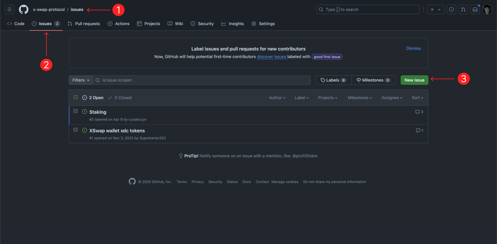

# XSwap Protocol Issues
This repo is created to collaborate with community. By reporting a bug or suggesting any kind of feature you are helping us to improve our applications. Please, send the link of your opened issue into our [Telegram Chat](https://t.me/real_XSwapProtocol)

## How to report a bug or suggest feature? 
1) Open this repo
2) Go to [Issues](https://github.com/x-swap-protocol/issues/issues) tab
3) Click [New issue](https://github.com/x-swap-protocol/issues/issues/new/choose). You will be able to choose an issue type and use the proper template. 

